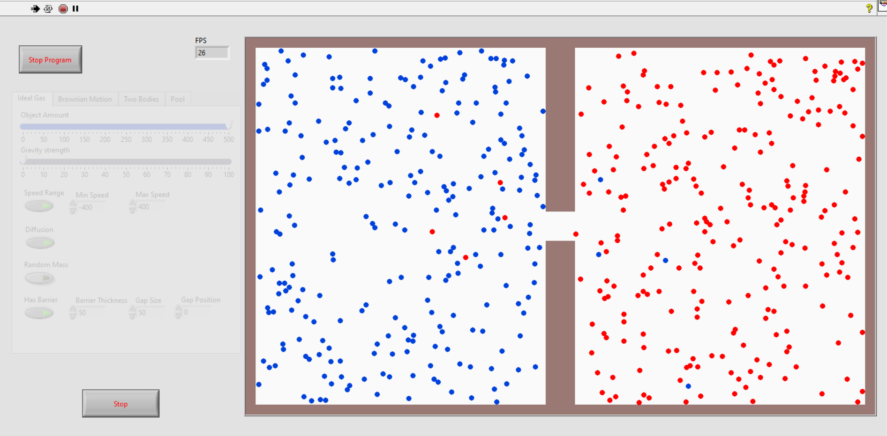
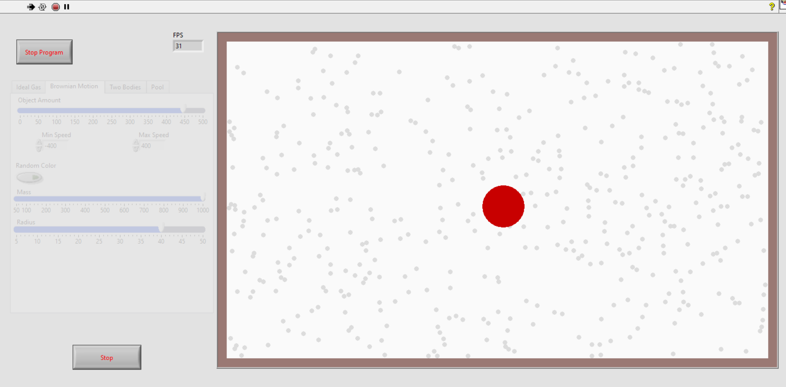
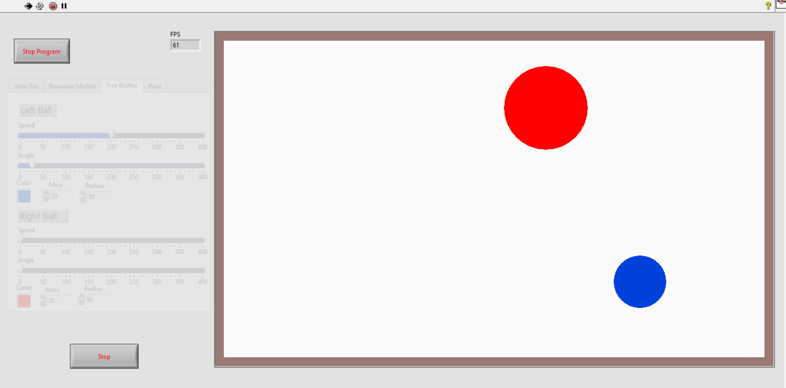
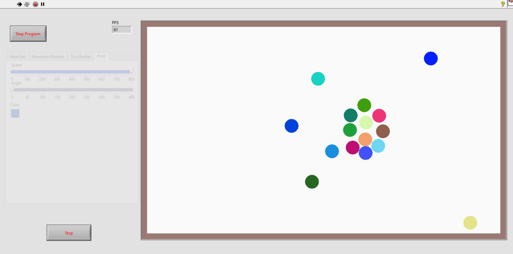

# Collision Simulator
This project is made as a final project for LabView course at Wrocław University of Science and Technology. It's consists of simple physics engine and four demonstrations. Physics included in simulations restricts only to gravity and collisions between circle and rectangle shapes

## Demonstrations
### Ideal Gas
It is a gas simulation, in which particles interact with each other and with walls of the container. We can control following parameters:
1. Object amount - number of objects simulated simultaneously. Supported values range from 0 to 500.
2. Gravity Strength - force applied to each particle. Gravity vector points downwards.
3. Speed Range - if toggled on, speed values are randomly choosen from range of values. In other case every particle has the same start velocity.
4. Diffusion - if toggled on, diffusion of blue and red gas paritcles is presented.
5. Random Color - if toggled on, every particles has different color.
6. Random Mass - if toggled on, every particles has different mass.
7. Has Barrier - if toggled on, menu for controlling barrier placed at the middle of the screen appears.

### Brownian Motion
Simulation of Brownian motion. At the start in the center big red particle is placed. Many smaller particlesact on it causing slow drift from starting positon. Following parameters can be controlled: 
1. Object amount - number of objects simulated simultaneously. Supported values range from 0 to 500.
2. Min Speed, Max Speed - range of speeds for smaller particles.
3. Random Color - if toggled on, the biggest particle has random color.
4. Mass - mass of the biggest particle.
5. Radius - radius of the biggest particle.

### Two Bodies
Simulation of collision between two particles. For each of the balls we can specify:
1. Speed - start speed of ball.
2. Angle - start movement angle measured from horizontal direction.
3. Color - color of the particle.
4. Mass - mass of the particle.
5. Radius - radius of the particle.

### Pool
Simple pool simulation. We can control:
1. Speed - start speed of left ball
2. Angle - angle at which left ball starts to move
3. Color - color of the left ball

